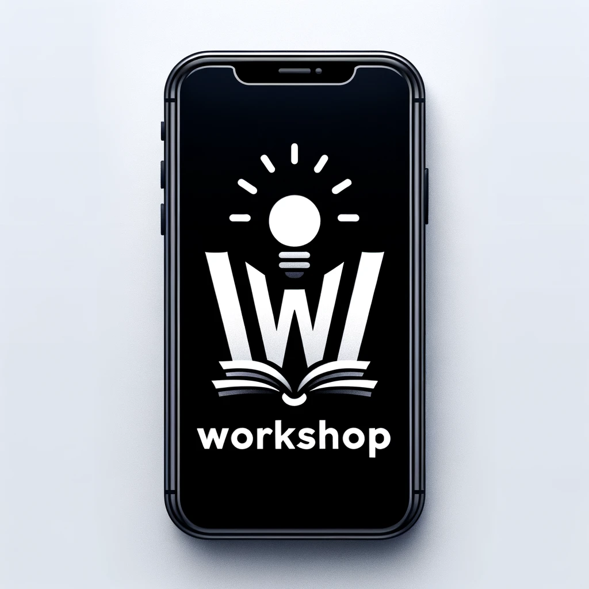

AI driven Workshop app to organize workshops and sign up to workshops.

## Project Structure

This project consists of a few elements such as the `backend` folder, containing a backend app as a proof-of-concept for this workshop application. In addition, `docs` contains diagrams and designs.

## Planning

Refer to the [Planning Document](PLANNING.md) to get insights into how this app could be planned in a startup setting.

## Documentation

- architecture and design docs [are available here](docs/README.md)
- Information about the [REST API docs and how to run it are available here](backend/README.md).

## Additional Remarks

- Logo generated with DALLE-3
