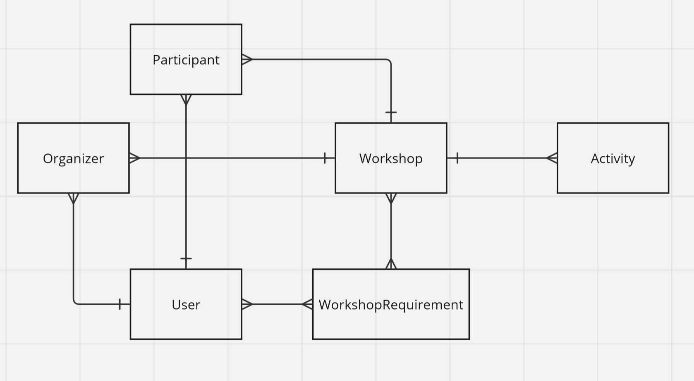
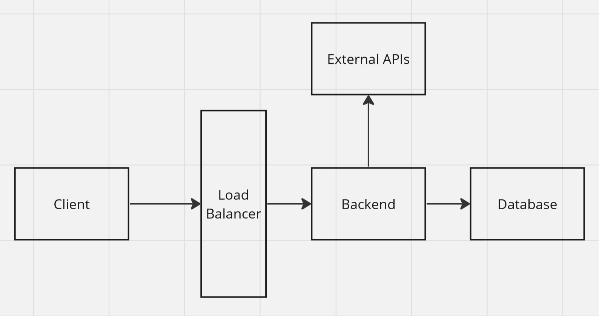
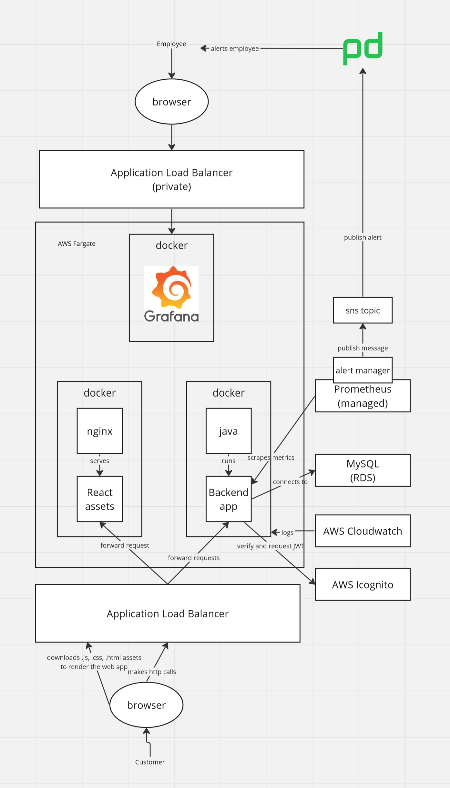
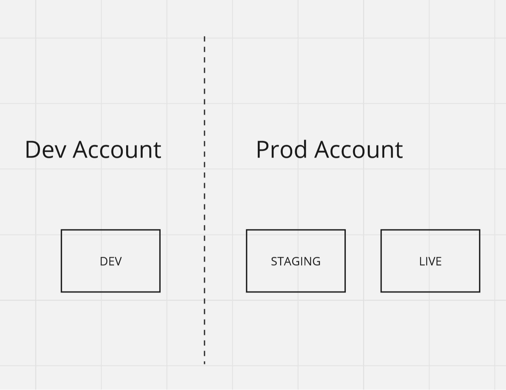

## Data Model

- **User** represents the person interacting with our system and can either _participate in_ or _organize_ workshops.
- **Workshop** is represents a workshop being organized and it has _one or many_ participants and \_one or many organizers.
- **Participant** has always _one_ user and each user can relate to _many_ participants. In addition, each participant can only ever participate in a single workshop at a time, but each workshop can have multiple participants. Whenever a user signs up for a new workshop, this would result in a new participant model. This model can be used to also track the status of the participation.
- **Organizer** has always _one_ user associated with it and each user can be an organizer of _many_ workshops. The organizer model tracks the status of the organization. For example, in case one of the organizers gets sick, another organizer can jump in and this can be reflected by its status accordingly.
- **WorkshopRequirement** tracks a specific need or prerequisite for a given workshop. A workshop does not have to specify requirements but in case they do, users will be made aware of it before becoming a participant in said workshop. This also allows for better filtering of workshops that match the users requirements. Note: this model simplifies the functionality of requirements but in future, requirements could be added to the `Organizer` too, so each organizer could bring their own set of requirements, especially useful when organizing larger workshops with multiple organizers.

## High Level Architecture

## Low Level Architecture

The final architecture of the app looks like this:

- the application loadbalancer accepts public traffic from the internet
- the private application loadbalancer accepts traffic from a private company VPC. This is especially useful to access private Grafana dashboards
- all docker containers run as services inside AWS Fargate
- Services are monitored via Prometheus through metrics scraping
- Alert Manager will trigger alerts and notify PagerDuty based on alerting rules
- other AWS services are configured on the AWS account. This setup is replicated across two environments.

## Environments

The app would be deployed across multiple AWS accounts into multiple environments for various reasons:

- **Security** - it is ensured that we do not impact production accidentally when developing features
- **Fine-grained access** - by default, we can configure Read-Only access to production and only with role elevation we can get write access

### AWS Dev Account

- **Dev Environment** any changes merged into `main` will be auto-deployed here. This environment is used for feature signoffs

### AWS Prod Account

- **Staging Environment** staging is effectively Production just that it is not used by live users. Useful for stakeholder demos and e2e testing
- **Live Environment** this is the live environment in production.
